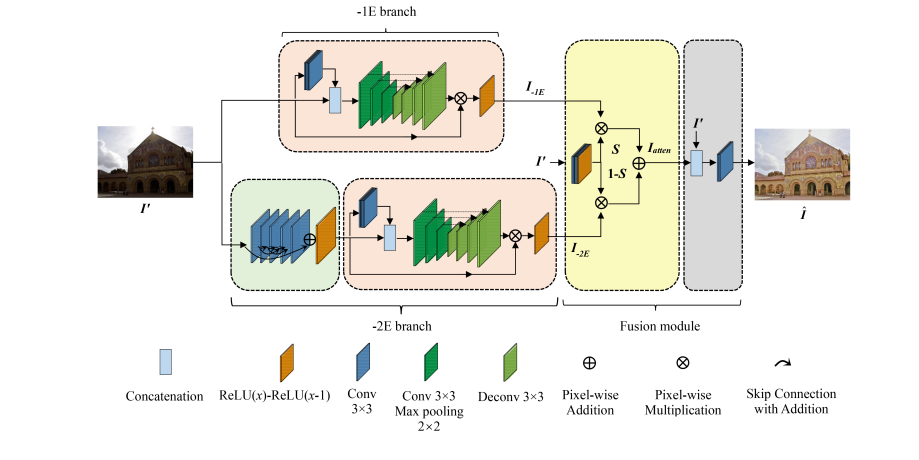
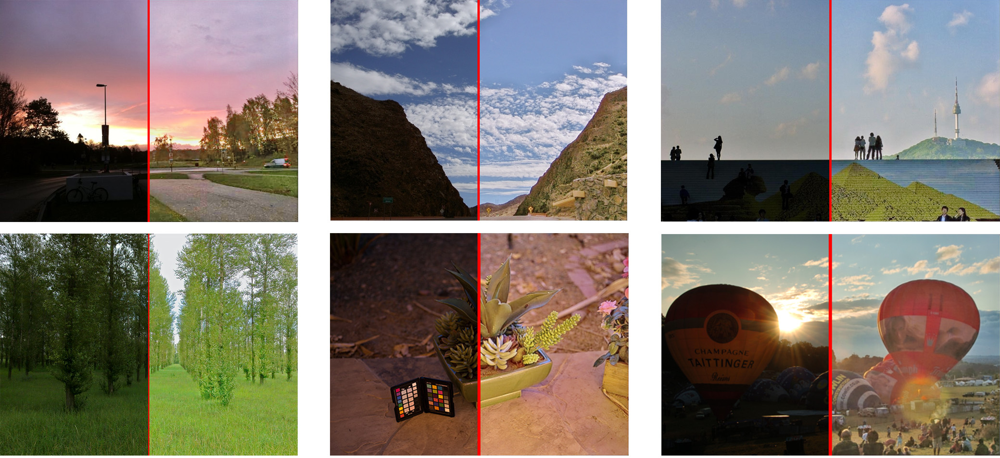
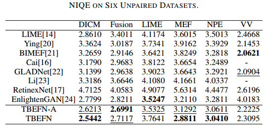

# TBEFN: A Two-branch Exposure-fusion Network for Low-light Image Enhancement


Codes for TMM20 paper ["TBEFN: A Two-branch Exposure-fusion Network for Low-light Image Enhancement"](https://ieeexplore.ieee.org/document/9261119).




### requirements TensorFlow 1.x
```
tensorflow==1.13.1
opencv-python
```

### requirements TensorFlow 2.x
```
tensorflow==2.6.0
tf-slim==1.1.0
opencv-python
```

### get started
1. file structure

|file|description|
|:-:|:-:|
|./input_dir|put your test image here|
|./results|output enhanced images|
|./ckpt|model weights (already provided, ~2MB)|
|./demo_img|used for demo|

2. how to run the code  
TensorFlow 1.x:
```
cd your_path
python predict_TBEFN.py
```  
TensorFlow 2.x:
```
cd your_path
python predict_TBEFN_tf2.py
```
### Colab
A Colab notebook which allows upload of your own photos and make predictions over them is available in [this repository](https://github.com/virtualramblas/python-notebooks-repo/tree/main/Colab/TBEFN).  
### results

We provide 6 images in this demo, after running this code, you will get results as follows. (we have cropped the result so that you can have a better comparison.)



### further comparison

0. comparison with some other sota work (DEC.19)


1. PSNR/SSIM/NIQE on paired dataset


2. NIQE on six commonly used dataset




3. Efficiency


### citation

```
@ARTICLE{9261119,
  author={K. {Lu} and L. {Zhang}},
  journal={IEEE Transactions on Multimedia}, 
  title={TBEFN: A two-branch exposure-fusion network for low-light image enhancement}, 
  year={2020},
  volume={},
  number={},
  pages={1-1},
  doi={10.1109/TMM.2020.3037526}}
```

