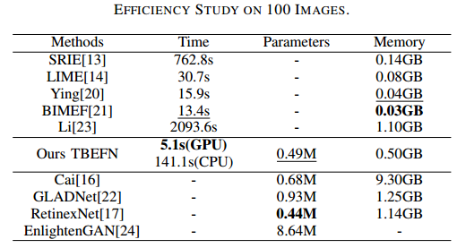

# TBEFN: A Two-branch Exposure-fusion Network for Low-light Image Enhancement


Our paper was submitted to IEEE TMM on Dec. 2019, and is still under peer review. 

Now, we have decided to release the test code and a demo on this project website. **Note that this release is used for research only with explicit citation. If you want to use this tool, please let we know - [hzmylys@gmail.com]**

### requirements
```
tensorflow==1.13.1
opencv-python
```

**Note that `tf.contrib.slim` module is used in this code, thus it could only run under tf 1.x. But we do not necessarily need to implement conv with `slim`, so with slight modification, it could run under tf 2.x **

### get started
1. file structure

|file|description|
|:-:|:-:|
|./input_dir|put your test image here|
|./results|output enhanced images|
|./ckpt|model weights (already provided, ~2MB)|
|./demo_img|used for demo|

2. how to run the code

```
cd your_path
python predict_TBEFN.py
```
### results

We provide 6 images in this demo, after running this code, you will get results as follows. (we have cropped the result so that you can have a better comparison.)


### further comparison
0. comparison with some other sota work (DEC. 2019)


1. PSNR/SSIM/NIQE on paired dataset


2. NIQE on six commonly used dataset


3. Efficiency



